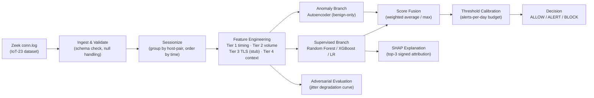

# Machine Learning-Based Detection and Blocking of Encrypted Command-and-Control Beaconing Traffic

A final-year B.Tech Computer Science capstone project that detects malware
command-and-control (C2) beaconing inside **encrypted** network traffic
without decrypting anything, by modelling the behavioural metadata of a
connection — timing regularity, byte-volume asymmetry, and connection-state
patterns — with a dual-branch machine learning system (supervised
classification + benign-trained anomaly detection), fused into a single
calibrated, explainable risk score and an offline-simulated enforcement
decision.

> **Status:** Phase 1 (detection core) complete and validated end-to-end
> against real IoT-23 traffic. Phase 2 (live capture, TLS/JA3 metadata,
> inline enforcement, feedback-driven retraining) is scoped in detail —
> see [Roadmap](#12-roadmap--future-work-phase-2).
>
> This work is being prepared for conference submission and is under
> consideration for patent protection — see
> [License & Patent Notice](#15-license--patent-notice).

---

## Table of contents

1. [Overview & motivation](#1-overview--motivation)
2. [Research gaps addressed](#2-research-gaps-addressed)
3. [Related work](#3-related-work)
4. [System architecture](#4-system-architecture)
5. [Dataset](#5-dataset)
6. [Methodology](#6-methodology)
7. [Evaluation protocol](#7-evaluation-protocol)
8. [Current results](#8-current-results-phase-1-validation-run)
9. [Repository structure](#9-repository-structure)
10. [Getting started](#10-getting-started)
11. [Limitations](#11-limitations)
12. [Roadmap / future work (Phase 2)](#12-roadmap--future-work-phase-2)
13. [Project documentation map](#13-project-documentation-map)
14. [Citation](#14-citation)
15. [License & patent notice](#15-license--patent-notice)

---

## 1. Overview & motivation

Command-and-control beaconing is the pivot point of the modern intrusion
lifecycle: the phase at which an attacker converts an initial foothold into
persistent, remotely directed access. Every subsequent stage of an
attack — lateral movement, privilege escalation, data staging and
exfiltration — depends on it, which makes it the highest-leverage single
point of network-side interdiction available to a defender.

That channel is now effectively opaque. The overwhelming majority of
malicious traffic is TLS-encrypted, which defeats deep packet inspection
and signature-based rules against C2 payloads outright. Attackers compound
this by rotating infrastructure, forging or self-signing certificates,
mimicking mainstream browser TLS fingerprints, and — most damagingly for
classical detectors — configuring sleep and data jitter to destroy the
timing regularity that periodicity-based detection depends on.

Existing defences fail along four axes:

- **Signature/blocklist approaches** are defeated by infrastructure rotation
  and domain generation algorithms.
- **Rule-based periodicity detectors** only suppress the huge volume of
  legitimate beaconing (IoT devices, telemetry, update checks) through
  hand-tuned, environment-specific filter cascades.
- **Supervised ML detectors** report excellent laboratory figures yet
  collapse against real-world traffic, and by construction cannot recognise
  C2 frameworks absent from their training data.
- **Published work generally stops at a bare classification verdict** —
  offering no calibrated enforcement decision, no measured latency budget,
  and no explanation an analyst can act on.

This project's detection core targets exactly these four failure modes: it
distinguishes C2 beaconing from benign traffic using only metadata
derivable **without decryption**; it remains measurably effective as beacon
timing is deliberately randomised (validated with a synthetic jitter
sweep); it surfaces C2 behaviour absent from training data through a
complementary, benign-trained anomaly branch; and it produces a calibrated,
explainable verdict whose false-positive cost is expressed in operational
terms (alerts/day), not purely statistical ones.

---

## 2. Research gaps addressed

The design is a direct response to eight gaps identified in a structured
literature review of the C2-beaconing-detection field (companion documents:
[`prd.md`](prd.md) §12, and the literature survey referenced there).

| # | Research gap | How this project addresses it |
|---|---|---|
| GAP-1 | **Lab-to-real-world performance collapse.** Models evaluated only on random splits of lab-generated data report near-perfect scores that do not hold up against real, non-stationary traffic. | Every model is evaluated on **three** splits — random, temporal (train on earlier captures, test on later), and held-out-family (train on some malware families, test on entirely unseen ones) — and the *gap* between them is reported as a first-class finding, not hidden. |
| GAP-2 | **Jitter evasion is under-modelled.** Few studies quantify how much deliberate timing randomisation it takes to defeat a periodicity-based detector. | A synthetic jitter-injection harness perturbs beacon timestamps by ±0–50% and produces a **degradation curve** (recall vs. jitter level) — the project's headline robustness result. |
| GAP-3 | **Supervised models are blind to unknown C2.** A classifier can only recognise malware families it was trained on. | A second, independent branch — an autoencoder trained *exclusively on benign traffic* — flags anything that deviates from normal behaviour, and is evaluated specifically on malware families held out of all training. |
| GAP-4 | **TLS 1.3 / ECH / DoH erode metadata visibility over time.** Detectors built on features that will disappear as encryption improves are not future-proof. | Every feature is tagged with a **visibility tier** (timing / volume / TLS-metadata / context), and a per-tier ablation quantifies exactly how much detection power survives if a tier goes dark — reported as the *encryption-resistant floor*. |
| GAP-5 | **Class imbalance is masked by the wrong metrics.** Reporting accuracy or ROC-AUC under 1000:1+ imbalance is close to meaningless. | PR-AUC is the **mandated primary metric** throughout; accuracy and ROC-AUC are reported only as labelled secondary figures with an explicit caveat printed alongside every result. |
| GAP-6 | **Benign beaconing causes false positives.** Legitimate machine-to-machine traffic (IoT telemetry, update checks) is *also* periodic, and naïve periodicity detectors flag it. | The dataset itself (IoT-23) is chosen because its benign class is genuinely periodic consumer-IoT traffic — the model has to learn *malicious* periodicity vs. *legitimate* periodicity, not just periodic vs. aperiodic. |
| GAP-7 | **Detection is decoupled from enforcement.** Most published detectors stop at a probability score with no operational decision attached. | A three-tier decision layer (ALLOW / ALERT / BLOCK) derives its thresholds from an operator-specified alerts-per-day budget, and every decision is logged with full score provenance. |
| GAP-8 | **Alerts carry no explanation.** A bare "malicious" verdict gives an analyst nothing to act on or audit. | Every verdict carries a SHAP-derived, human-readable, top-3 signed feature attribution (e.g. *"interval CV 0.03 (highly regular) · response bytes 0 · destination fan-in 1"*). |

Six of the eight gaps are fully addressed in Phase 1; GAP-2 and GAP-4 are
partially addressed, with the remainder scoped explicitly into Phase 2 (see
[Roadmap](#12-roadmap--future-work-phase-2)).

---

## 3. Related work

Key references informing the problem framing, dataset choice, evaluation
protocol, and design decisions in this project:

| Reference | Relevance to this project |
|---|---|
| Abu Talib, M. et al. (2022). *APT beaconing detection: A systematic review.* Computers & Security, 122, 102875. | Structured survey used to scope the threat model and identify the eight gaps above. |
| Anderson, B. & McGrew, D. (2016). *Identifying encrypted malware traffic with contextual flow data.* ACM AISec. | Established the case for behavioural/contextual flow metadata over payload inspection for encrypted malware traffic. |
| Anderson, B. & McGrew, D. (2017). *Machine learning for encrypted malware traffic classification.* ACM SIGKDD. | Source of the temporal (non-stationary) train/test split methodology used in this project's evaluation protocol, and the observation that analyst-assigned labels carry noise. |
| Arp, D. et al. (2022). *Dos and don'ts of machine learning in computer security.* USENIX Security. | Checklist used to audit this project's pipeline against common ML-security pitfalls (temporal leakage, spurious correlations, base-rate fallacy) — directly motivates the leakage-prevention design decisions (§6). |
| Alageel, A. & Maffeis, S. (2022). *EarlyCrow: Detecting APT malware C2 over HTTP(S).* Springer ISC. | Source of the held-out-family generalisation-testing protocol adopted here as the project's hardest, most honest evaluation split. |
| Fu, C. et al. (2023). *Detecting unknown encrypted malicious traffic via flow interaction graph analysis.* NDSS. | Informs the destination fan-in/fan-out context features (Tier 4) used to capture network-level relationships beyond a single flow. |
| Garcia, S., Parmisano, A. & Erquiaga, M.J. (2020). *IoT-23: A labeled dataset with malicious and benign IoT network traffic.* Zenodo. DOI: [10.5281/zenodo.4743746](https://doi.org/10.5281/zenodo.4743746). | **Primary dataset** for this project — see [§5](#5-dataset). |
| Hu, X. et al. (2016). *BAYWATCH: Robust beaconing detection.* IEEE/IFIP DSN. | Early reference architecture for periodicity-based beacon detection; informs the Tier-1 timing feature set (IAT statistics, autocorrelation). |
| Känzig, N. et al. (2019). *Machine learning-based detection of C&C channels.* IEEE CyCon. | Comparative baseline for supervised classifier choice (Random Forest / gradient boosting over flow features). |
| Novo, C. & Morla, R. (2020). *Flow-based detection and proxy-based evasion of encrypted malware C2 traffic.* ACM AISec. | Source of the adversarial jitter/padding evasion model used in the robustness harness (§6), and the finding motivating this project's distinction between feature-space and physically-realisable evasion. |
| Ramos, R. & Wang, X. (2023). *Detecting stealthy Cobalt Strike C&C activities from encrypted network traffic.* Springer MLN. | Basis for calibrating this project's acceptance criteria against realistic (not laboratory-optimistic) published detection rates. |
| Sommer, R. & Paxson, V. (2010). *Outside the closed world: On using machine learning for network intrusion detection.* IEEE S&P. | Foundational critique of ML-for-IDS evaluation practice; motivates the three-way (random/temporal/held-out-family) split protocol adopted throughout. |

The full literature survey (structured spreadsheet plus supporting notes)
underlying this table is a companion document referenced in
[`prd.md`](prd.md) (front matter) and available on request.

---

## 4. System architecture



The core design principle is **two independent detectors that fail in
different ways**: the supervised branch recognises patterns it has seen
before but is blind to novel C2 families; the anomaly branch has never seen
malicious traffic and instead flags anything that deviates from a learned
model of "normal," which lets it catch families the supervised branch
never trained on. Their scores are fused into one calibrated risk value
before a decision is made.

| Module | Responsibility |
|---|---|
| `beacon_detection/ingest.py` | Loads and validates raw Zeek `conn.log` data; aborts loudly if required columns are missing rather than degrading silently. |
| `beacon_detection/sessionize.py` | Groups flows into host-pair "conversations" and computes inter-arrival deltas — the prerequisite for every timing feature. |
| `beacon_detection/features/` | One module per feature family (timing, volume, connection-state, context), each tagging its output columns with a visibility tier for later ablation. |
| `beacon_detection/models/supervised.py` | Random Forest / XGBoost / Logistic Regression, with explicit class-imbalance handling and probability calibration. |
| `beacon_detection/models/anomaly.py` | Autoencoder trained exclusively on benign flows, plus Isolation Forest / One-Class SVM baselines. |
| `beacon_detection/models/fusion.py` | Combines both branch scores into a single risk value (weighted-average or max-score fusion, compared empirically). |
| `beacon_detection/decision.py` | Derives ALLOW/ALERT/BLOCK thresholds from an alerts-per-day budget and logs every decision with full score provenance. |
| `beacon_detection/explain.py` | SHAP-based global and per-verdict local explanation, rendered as a human-readable sentence. |
| `beacon_detection/adversarial.py` | Synthetic jitter injection and the resulting recall-degradation sweep. |
| `beacon_detection/evaluate.py` | The full metric suite across all three splits, per-tier ablation, and report generation. |

A full, plain-language walkthrough of every step is in
[`exec.md`](exec.md).

---

## 5. Dataset

**Primary dataset — [Aposemat IoT-23](https://www.stratosphereips.org/datasets-iot23)**
(Garcia, Parmisano & Erquiaga, 2020, Zenodo, DOI:
[10.5281/zenodo.4743746](https://doi.org/10.5281/zenodo.4743746)): 23
captures (20 malicious, 3 benign) of real malware — Mirai, Torii, Okiru,
Gagfyt, Kenjiro, Hakai, IRCBot, Muhstik, Hide-and-Seek and others — executed
against genuine consumer IoT devices (a Philips Hue lamp, an Amazon Echo,
a Somfy smart lock), produced by the Stratosphere Laboratory (CTU
University, Prague).

This dataset was chosen deliberately, not for convenience:

- **It labels C2 beaconing explicitly** — the `C&C-HeartBeat` label is
  defined by the dataset authors using exactly the criteria this project
  models (near-zero response bytes, periodic connections, suspicious
  destination), giving exact ground truth for the target phenomenon.
- **Both classes are real** — malware on real hardware, benign traffic from
  real consumer IoT devices, neither simulated.
- **Its benign traffic is genuinely periodic** (smart-home devices poll
  cloud services constantly), which is exactly the property needed to
  address GAP-6 above: a model trained on this data has to learn
  *malicious* periodicity vs. *legitimate* periodicity, the harder and more
  meaningful problem.
- **It supports held-out-family generalisation testing**, since captures
  are separated by malware family.

A binary target is constructed from the `detailed-label` field
(`C&C`, `C&C-HeartBeat`, `C&C-FileDownload`, `C&C-HeartBeat-FileDownload`,
`C&C-Torii`, `C&C-Mirai` → positive; `Benign` → negative). Non-beaconing
attacks in the same dataset (port scans, DDoS, generic "Attack") are
deliberately **excluded** rather than folded into either class — including
them would train a generic "malicious traffic" detector and contradict the
attack-specific scope of this project. Full schema, target-construction
rationale, class-imbalance figures, and known dataset limitations are in
[`prd.md`](prd.md) §4.

---

## 6. Methodology

**Feature engineering** (identity-agnostic by design — no raw IP address
ever enters the feature set, so the model cannot be defeated simply by
infrastructure rotation):

- **Tier 1 — Timing:** inter-arrival mean/std/median/CV/MAD, normalised
  autocorrelation periodicity score, dominant FFT power, session span and
  duty cycle.
- **Tier 2 — Volume:** origin/response byte ratio (captures the
  near-zero-response heartbeat signature), packet counts and ratios, mean
  packet sizes, throughput, byte variance within a session.
- **Connection-state features:** Zeek connection state, protocol, service,
  port behaviour (ephemeral vs. common).
- **Tier 4 — Context:** destination fan-in, source fan-out, destination
  flow count.
- **Tier 3 — TLS metadata** (JA3 fingerprinting, certificate properties) is
  scoped and stubbed but not implemented in Phase 1, since the dataset
  variant used here does not retain TLS handshake logs — see
  [Limitations](#11-limitations) and [Roadmap](#12-roadmap--future-work-phase-2).

**Leakage prevention** (directly informed by Arp et al., 2022): categorical
vocabularies and scalers are fit on the training split only and applied
unchanged to validation/test data; splitting happens before
featurisation/encoding, never after.

**Dual-branch detection:** a supervised classifier (Random Forest primary,
XGBoost and Logistic Regression compared) handles known-pattern
recognition with explicit class-imbalance handling (class weighting vs.
SMOTE, compared) and probability calibration (isotonic/Platt); a
benign-trained autoencoder handles anomaly detection, with its threshold
set from the benign reconstruction-error distribution — never from
test-set performance, to avoid tuning on the evaluation data.

**Fusion & decision:** both branch scores are combined into one calibrated
risk value; ALLOW/ALERT/BLOCK thresholds are derived from an
operator-specified alerts-per-day budget rather than an arbitrary score
cutoff.

**Explainability:** SHAP attributes each verdict to its top-3 contributing
features with signed direction, rendered as a plain sentence.

**Adversarial evaluation:** synthetic jitter (0–50% of the base interval)
is injected into known-beaconing traffic and the resulting recall
degradation is measured and reported as a curve — the project's primary
robustness claim.

---

## 7. Evaluation protocol

Three splits are produced and **all three are reported** — the gap between
split 1 and splits 2/3 is itself treated as a finding, not hidden:

1. **Random stratified split (70/15/15)** — the optimistic baseline most
   student projects report alone.
2. **Temporal split** — train on chronologically earlier captures, test on
   later ones (Anderson & McGrew, 2017).
3. **Held-out-family split** — train on a subset of malware families, test
   on families entirely absent from training (EarlyCrow protocol).

PR-AUC is the mandated **primary** metric under this dataset's severe class
imbalance; accuracy and ROC-AUC are reported only as labelled secondary
figures. Per-tier ablation (Tier 1 only → Tier 1+2 → Tier 1+2+4) quantifies
each feature family's marginal contribution — the *encryption-resistant
floor* the system would retain if a tier's signal disappeared. Full
acceptance criteria are in [`prd.md`](prd.md) §8.2.

---

## 8. Current results (Phase 1 validation run)

> **Read this caveat before quoting any number below.** The dataset variant
> currently configured (`engraqeel/iot23preprocesseddata`, a ~6M-row Kaggle
> subset of IoT-23) contains only **26 distinct beaconing conversations**
> after sessionisation, of which 21 survive the minimum-session-length
> filter. This run is a **pipeline-correctness validation** — it confirms
> every stage runs end-to-end and produces internally consistent,
> sensible results — **not** a statistically powered capstone evaluation.
> Metrics below will swing noticeably between random seeds at this sample
> size. A capstone-quality evaluation should re-run against the full,
> un-subsampled IoT-23 dataset (see [`run.md`](run.md) §4.2 for the exact
> counts and the recommended full-dataset source).

| Split | PR-AUC (fused) | Precision @ threshold | Recall @ threshold | FPs / day (assumed 1,000 flows/day) |
|---|---|---|---|---|
| Random (70/15/15) | 0.639 | 0.750 | 1.000 | 15.9 |
| Temporal | 0.469 | 0.500 | 0.400 | 32.8 |
| Held-out-family (`C&C`, `C&C-HeartBeat-FileDownload` held out) | 0.592 | 0.714 | 0.385 | 16.0 |

The consistent drop from the random split to the temporal and
held-out-family splits is the expected, honest signature of genuine
generalisation difficulty (rather than memorisation) that this project's
evaluation protocol is specifically designed to surface — see
[§2, GAP-1](#2-research-gaps-addressed).

**Per-tier ablation** (random split): Tier 1 (timing) alone reaches
PR-AUC 0.694; adding Tier 2 (volume) and Tier 4 (context) does not improve
it further at this sample size — consistent with timing regularity being
the dominant signal for heartbeat-style C2, and volume/context features
adding negotiable robustness to be tested at scale.

**Jitter degradation curve** (random split, supervised branch): recall
stays at 1.00 through 10% jitter and settles at 0.952 from 20% through
50% jitter — i.e. this run shows negligible degradation under the tested
jitter range, itself a finding that should be re-validated on a larger
positive sample before being treated as a robust claim.

**Top global SHAP features:** `history_has_S` (Zeek history contains a
SYN-only state), `iat_median`, `iat_min` (timing regularity), `mean_pkt_size_orig`,
`orig_pkts`, `total_bytes` — a mix of connection-state and timing features
dominates, with raw volume contributing second-order signal.

**Reproducing this run:**

```bash
cd c2-beaconing-detection
python3 -m venv .venv && source .venv/bin/activate
pip install -r requirements.txt
python run_pipeline.py --config config/default.yaml
cat outputs/logs/evaluation_report.json | python3 -m json.tool | less
```

Full instructions, including how to fetch a fuller dataset variant for a
statistically stronger evaluation, are in [`run.md`](run.md).

---

## 9. Repository structure

```
FY_proj/
├── README.md                         # this file — project overview, gaps, references, results
├── prd.md                            # full Product Requirements Document (scope, requirements, evaluation criteria)
├── exec.md                           # plain-language architecture walkthrough
├── run.md                            # step-by-step setup / run / test guide
└── c2-beaconing-detection/           # implementation
    ├── config/default.yaml           # every threshold and hyperparameter — no magic numbers in code
    ├── beacon_detection/
    │   ├── ingest.py                 # loading, schema validation, data profiling
    │   ├── sessionize.py             # host-pair grouping, inter-arrival derivation
    │   ├── features/                 # timing.py, volume.py, connstate.py, context.py, tls_stub.py
    │   ├── models/                   # supervised.py, anomaly.py, fusion.py
    │   ├── decision.py                # threshold calibration, ALLOW/ALERT/BLOCK simulation
    │   ├── explain.py                 # SHAP global + local explanation
    │   ├── adversarial.py             # jitter-injection robustness sweep
    │   └── evaluate.py                # metrics, splits, ablation, report generation
    ├── notebooks/                     # data exploration, feature analysis, results inspection
    ├── tests/                         # unit tests against synthetic flow data (no dataset required)
    ├── run_pipeline.py                # single-command, reproducible end-to-end entry point
    └── requirements.txt
```

---

## 10. Getting started

```bash
cd c2-beaconing-detection
python3 -m venv .venv
source .venv/bin/activate            # Windows: .venv\Scripts\activate
pip install -r requirements.txt

pytest                                # verify the code — synthetic data, no dataset needed

# fetch the dataset (see run.md §4 for manual-download alternatives)
pip install kagglehub
python3 -c "import kagglehub; print(kagglehub.dataset_download('engraqeel/iot23preprocesseddata'))"

python run_pipeline.py --config config/default.yaml   # full pipeline: ingest -> ... -> evaluation report
```

Requires Python 3.10+ (developed/tested on 3.12), no GPU. See
[`c2-beaconing-detection/README.md`](c2-beaconing-detection/README.md) for
the short version and [`run.md`](run.md) for the complete guide, including
troubleshooting and dataset-schema verification.

---

## 11. Limitations

- **No TLS metadata in Phase 1.** The Zeek `conn.log` source used here
  contains no `ssl.log`; Tier 3 (JA3/certificate) features are scoped and
  stubbed but not validated. Phase 1 results should be read as the
  encryption-resistant floor (Tier 1+2 only).
- **IoT device traffic, not enterprise traffic.** Beacon intervals and
  benign baselines observed here may not transfer directly to an
  enterprise network; Phase 2 adds enterprise captures for cross-domain
  validation.
- **Captures predate TLS 1.3 ubiquity and current C2 frameworks** (2018–2019).
  Tier 1/2 features are protocol-agnostic and the least affected by this,
  but the point should be stated plainly rather than assumed away.
- **Labels are analyst-assigned, not cryptographically verified** — some
  label noise is expected (Anderson & McGrew, 2017).
- **Severe class imbalance and, in the currently configured Kaggle subset,
  a very small absolute number of positive sessions** — see the caveat in
  [§8](#8-current-results-phase-1-validation-run). Naive models can appear
  excellent on accuracy while detecting nothing; this is why PR-AUC is
  mandated as the primary metric throughout.
- **Enforcement is simulated, not live.** ALLOW/ALERT/BLOCK decisions are
  logged, not wired to a real firewall — see Roadmap FS-4.

---

## 12. Roadmap / future work (Phase 2)

Phase 1 covers roughly 75% of the full eight-stage reference architecture
by weighted scope (see [`prd.md`](prd.md) §2.1 for the exact weighting).
The remaining 25% is scoped in the same level of detail as Phase 1 so that
the deferred work reads as *planned*, not *unconsidered*:

| Item | Weight | Blocker |
|---|---|---|
| TLS metadata extraction and JA3 fingerprinting | 8% | Requires reprocessing raw IoT-23 PCAPs with Zeek configured to emit `ssl.log`/`x509.log` |
| Live packet capture and streaming inference | 6% | Requires a controlled network testbed / span port |
| DNS, domain age, and reputation context | 4% | Requires external WHOIS/passive-DNS/reputation API access |
| Genuine inline enforcement (firewall integration) | 3% | Requires `iptables`/`nftables` or pfSense testbed and a fail-open safety design |
| Feedback loop and drift-triggered retraining | 2% | Requires deployment history, which does not exist before Phase 2 |
| Adversarial hardening (iterative retraining) | 1% | Depends on the live-capture testbed |
| Analyst dashboard | 1% | Deferred by priority only, no technical blocker |

Full Phase 2 scoping, including the specific engineering plan and success
criteria for each item, is in [`prd.md`](prd.md) §13.

---

## 13. Project documentation map

| Document | Purpose |
|---|---|
| [`README.md`](README.md) | This file — project overview, research gaps, related work, architecture, results. Start here. |
| [`prd.md`](prd.md) | Full Product Requirements Document: scope definition, functional/non-functional requirements, dataset specification, evaluation protocol and acceptance criteria, gap-to-requirement traceability, Phase 2 scoping, glossary, and bibliography. |
| [`exec.md`](exec.md) | Plain-language, module-by-module explanation of what the code does and why, for a reader unfamiliar with the codebase. |
| [`run.md`](run.md) | Complete step-by-step setup, dataset acquisition, run, and test guide, including measured dataset statistics and troubleshooting. |
| [`c2-beaconing-detection/README.md`](c2-beaconing-detection/README.md) | Short quick-start version of `run.md`, scoped to the implementation directory. |

---

## 14. Citation

If you build on this work, please cite it as:

```bibtex
@misc{c2_beaconing_detection_2026,
  title  = {Machine Learning-Based Detection and Blocking of Encrypted
            Command-and-Control Beaconing Traffic},
  author = {Vijayvankar, Kshitij},
  year   = {2026},
  note   = {Final-year B.Tech Computer Science capstone project},
  howpublished = {\url{https://github.com/kvanzar/FY_proj}}
}
```

and the primary dataset:

```bibtex
@dataset{garcia_iot23_2020,
  author = {Garcia, Sebastian and Parmisano, Agustin and Erquiaga, Maria Jose},
  title  = {IoT-23: A labeled dataset with malicious and benign IoT network traffic},
  year   = {2020},
  publisher = {Zenodo},
  doi    = {10.5281/zenodo.4743746}
}
```

---

## 15. License & patent notice

This repository is shared for academic evaluation and research
transparency. All rights are reserved by the author; no license is
currently granted for reuse, redistribution, or derivative works. This
project is under consideration for patent protection and/or conference
submission — please contact the author before reusing any part of this
work.
